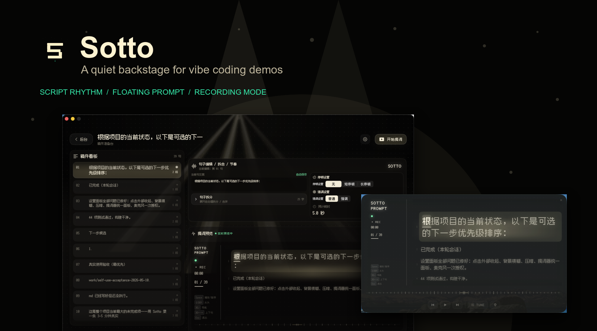
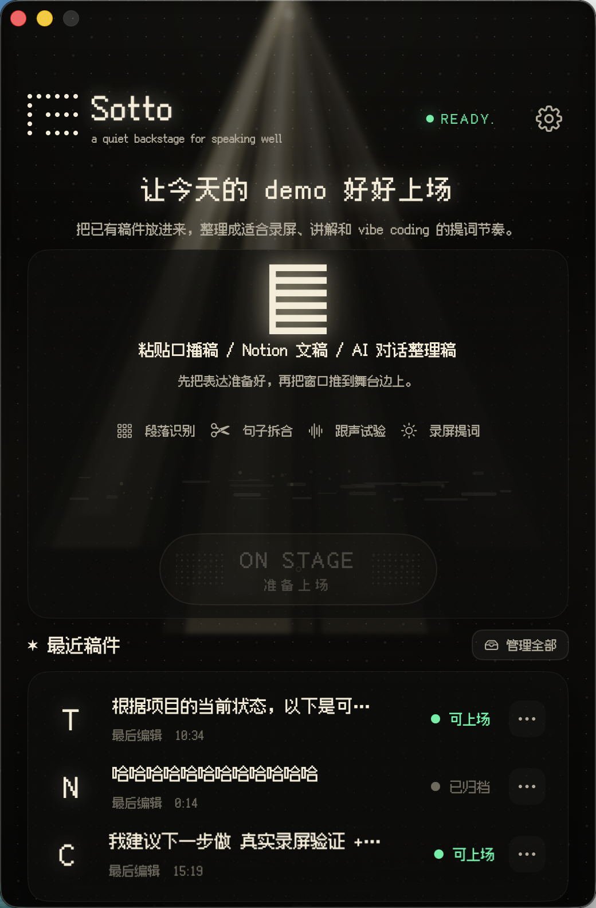
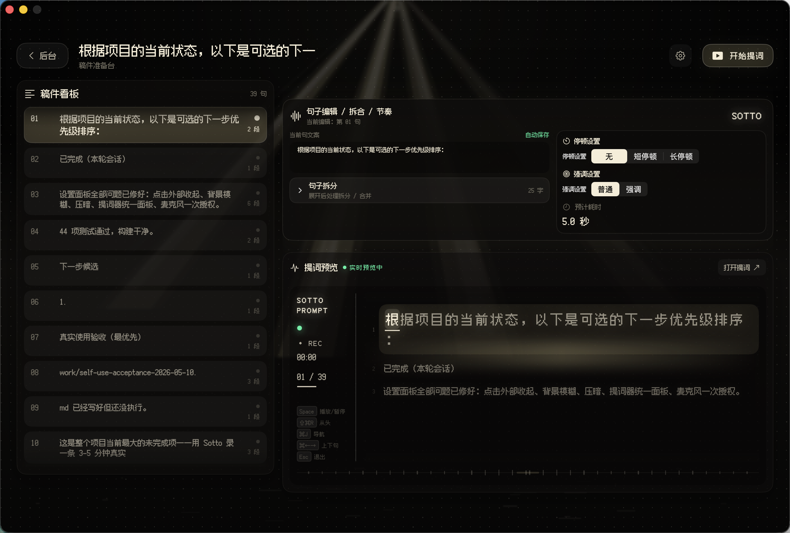
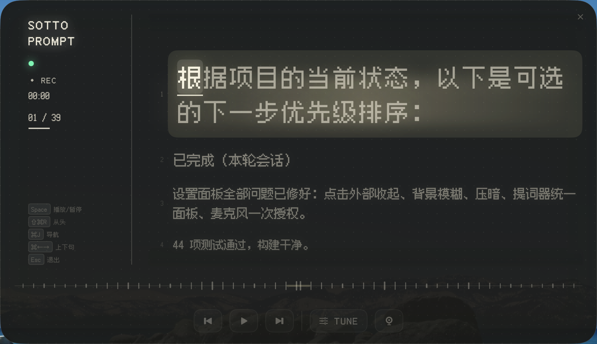
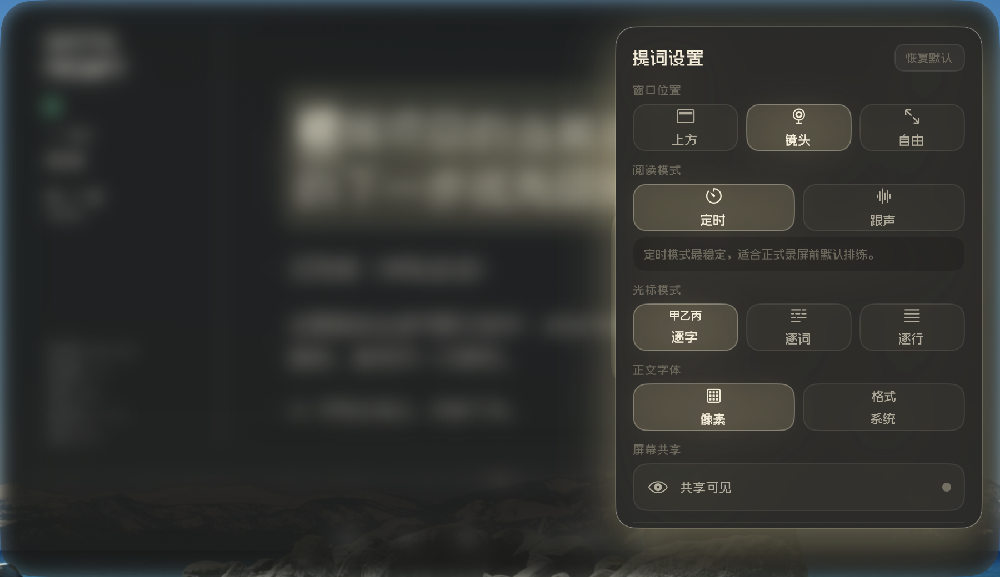

# Sotto

> 中文 | [English](README.en.md)

面向 vibe coding 演示的个人 macOS 提词器。

<p align="center">
  
</p>

打开 Sotto，暗色舞台上几束暖光在缓慢呼吸，像素字体安静地等你把稿子放进来。它不是一个冷冰冰的滚动文本框——更像一个陪在你旁边的提词伙伴。不抢戏、不催促，在你需要的时候刚好在那里。

把准备好的口播稿贴进来，它会自动拆成句子和短语节奏。打开悬浮提词窗口，放在镜头附近，然后你只需要专注做一件事：把想说的话讲清楚。暖色光标扫过当前句，按你的节奏推进——定速也好，跟声也好——它只在你准备好时才往前走。

这是属于表达者的后台时刻：安静、有准备、不慌张。



> English version: [README.en.md](README.en.md)

## 为什么做这个

录制一段 vibe coding 或 AI 产品 demo，真正的难点不是把东西做出来，而是边做边讲：为什么这么做、当前在看什么、下一步意味着什么。

普通提词器太像文本框，缺少"在舞台上"的感觉；完整的 AI 导演工具对第一版来说又太重。Sotto 从我最需要的一层开始：给准备好的脚本一个安静、有舞台感、不打扰的提词体验。

它帮我做到几件事：

- 展示代码、产品和工作流时，表达更稳、更自然。
- 稿子在旁边，但不遮挡真正的 demo 画面。
- 录制前先调整节奏和停顿，不用每句话现场即兴。
- 让提词器本身也成为 vibe coding 作品的一部分——做工具的人，也是用工具的人。

## 当前状态

Sotto 目前是一个供个人使用和公开学习的 MVP 0.1 版本。核心提词闭环已经可以在本地运行，但它还不是一个完整打磨过的正式产品。

最近本地已验证：

- `swift test` 通过 44 个测试。
- `./script/build_and_run.sh --verify` 可以构建并启动 `dist/Sotto.app`。
- 当前 App 截图和一段静默 demo slideshow 已从真实运行版本中截取。

仍在验证中：

- 首次启动时的麦克风权限体验。
- 真实录制时的跟声阈值。
- 在具体录屏 / 会议工具里的屏幕共享隐藏效果。
- 长稿稳定性和性能。
- 一段完整的 3-5 分钟真实口播 demo。

## 主要功能

### 稿件准备

- 粘贴准备好的口播稿。
- 自动把中英文内容拆成句子和短语。
- 直接编辑当前句子。
- 把一句拆成两句，或与上一句 / 下一句合并。
- 为句子设置停顿和强调，影响提词节奏。
- 将稿件保存到本地稿件库。

### 提词体验

- 打开置顶的 AppKit 悬浮提词窗口。
- 支持定速播放和跟声播放。
- 使用 token 级光标：中文按字推进，英文 / 数字按词推进。
- 点击句子即可在排练或录制中跳转。
- 通过 TUNE 抽屉调整速度、字号、透明度、宽度和亮度。
- 支持位置预设和常用键盘快捷键。

### 录制模式

- 专注模式会在提词窗口打开时隐藏主编辑窗口。
- 可选的屏幕共享隐藏行为，在受支持的 macOS 捕获路径中让提词窗口不进入录屏画面。
- 低干扰暗色舞台 UI 保证稿子可读，但不抢演示主体。
- 内置 Fusion Pixel Font 字体资源，保持当前视觉风格的可移植性。

## 截图

以下截图来自当前本地 MVP 运行版本。










短版静默 demo slideshow： [artifacts/github-media/sotto-demo-slideshow.mp4](artifacts/github-media/sotto-demo-slideshow.mp4)。

设计方向记录在：

- [Sotto UI Design Baseline](docs/sotto-ui-design-baseline-v1.md)
- [Homepage Reference](docs/references/homepage-reference-v1.md)
- [Prompt Window Reference](docs/references/prompt-window-reference-v1.md)
- [Script Editor Reference](docs/references/script-editor-reference-v1.md)

## 本地运行

要求：

- macOS 15 或更高版本
- Swift 6 toolchain

运行测试：

```bash
swift test
```

构建并启动本地 App：

```bash
./script/build_and_run.sh --verify
```

这个脚本会构建 SwiftPM package，创建 `dist/Sotto.app`，启动 App，并验证进程是否正在运行。

## 项目结构

```text
Sources/
  Sotto/                 # SwiftUI App、AppKit 提词窗口、视觉系统
  SottoCore/             # 模型、切分、编辑、存储、计时逻辑
Tests/SottoTests/        # 核心逻辑和 App 状态测试
script/                  # 构建与运行辅助脚本
docs/                    # 稳定的产品、设计和实现说明
work/                    # 推进中的研究、评审和验收记录
artifacts/               # 本地参考素材；大型 / 原始素材目录已忽略
```

## 路线图

### 公开 demo 前

- 录制一段真实的 3-5 分钟 vibe coding demo。
- 优化麦克风权限和 fallback 状态。
- 用实际录屏工具验证屏幕共享隐藏行为。

### MVP 0.2 候选

- 更好的长稿导航。
- 可调的跟声激活阈值。
- 面向长稿的可读字体模式。
- 稿件导入 / 导出。
- 外接屏或 viewer mode。

### 更远的想法

- AI 辅助改写口播稿。
- 从 demo outline 生成 speaking script。
- 基于语音识别的跟读定位。
- 浏览器或远程 companion view。

## 已知限制

- 当前跟声播放基于音量门控，不是完整语音识别。
- 屏幕共享隐藏依赖 macOS 窗口行为，需要结合具体录屏 / 会议工具验证。
- Sotto 优先服务我的工作流，不急于做成通用提词器。
- 目前没有签名发布包。
- 当前 demo 视频是静默截图 slideshow，不是完整讲解视频。

## 设计说明

Sotto 的视觉方向是「安静的暗色后台」，而不是普通生产力仪表盘。它使用暖色舞台光、细微点阵、像素标签和悬浮提词窗口，让表达变得更有准备感，但不让工具本身喧宾夺主。

关键设计参考和决策：

- [Product Definition V1](docs/product-definition-v1.md)
- [Sotto Interaction and Motion Principles](docs/sotto-interaction-motion-principles-v1.md)
- [MVP 0.1 Design Spec](docs/superpowers/specs/2026-05-02-spotlight-flow-teleprompter-mvp-design.md)
- [GitHub Public README Plan](work/github-public-readme-plan-2026-05-10.md)

## 公开发布记录

当前公开发布路线记录在：

- [Self-use Acceptance Plan](work/self-use-acceptance-2026-05-10.md)
- [Public Release Readiness Review](work/public-release-readiness-review-2026-05-10.md)
- [Public Release Media Check](work/public-release-media-check-2026-05-11.md)

这个仓库希望同时展示 App 本身和它的过程：产品判断、视觉探索、真实使用反馈和实现取舍。

## 关于作者

我是 [Dv. (Dewens)](https://github.com/Dewensong)，一个不会写 Swift 的 AI 产品经理。

Sotto 是我和 AI 结对编程做出来的第一个完整 macOS App。没有 macOS 开发经验，没有设计师——只有一个人、一个想法、和一个愿意陪我反复试错的 AI。

过程大概是这样：我负责"这不对劲"和"再试一次"，AI 负责写代码。听起来像作弊，但你试试就知道——让 AI 理解你想要什么，本身就是一种手艺。

这个仓库是我的诚实答卷：一个产品经理靠 vibe coding 能走多远。如果你也在做类似的事，或者想聊聊产品、AI、以及非开发者怎么用 AI 做工具，欢迎在 [GitHub Issues](https://github.com/Dewensong/sotto/issues) 上找我聊聊。

## 不只是代码

这个仓库放的不是"做完的样子"，而是"怎么从零做出来的"。

每一步都留了底：

- **[产品定义](docs/product-definition-v1.md)** — 为什么做提词器而不是别的，第一版到底做多少算够。
- **[视觉设计基线](docs/sotto-ui-design-baseline-v1.md)** — 暗色舞台、像素字体、暖色微光，这些审美偏好是怎么落地成产品语言的。
- **[交互动效原则](docs/sotto-interaction-motion-principles-v1.md)** — 顶光为什么要呼吸、光标为什么扫过去而不是硬切——以及从一堆酷炫参考里忍痛删掉了什么。
- **[关键决策记录](decisions.md)** — 选了什么、拒绝什么、为什么。
- **[逐日推进记录](progress.md)** — 每天干了什么、搞砸了什么、修好了什么。
- **[真实使用验收](work/self-use-acceptance-2026-05-10.md)** — 自己用上之后才发现的问题清单。

如果你也在用 vibe coding 做东西，这些过程文档可能比源码本身更有意思。不妨翻翻，看看一个产品经理和 AI 对话 10 天，能磨出什么来。

## Credits and References

- [Fusion Pixel Font](https://github.com/TakWolf/fusion-pixel-font)：内置字体资源，采用 SIL Open Font License。详见 [FusionPixelFont-OFL.txt](Sources/Sotto/Resources/Fonts/FusionPixelFont-OFL.txt)。
- [Textream](https://github.com/f/textream)：作为开源 macOS 提词器机制参考，用于研究跟声提词和屏幕共享隐藏等方向。Sotto 不复制 Textream UI，也不把 Textream 源码纳入本 App。
- 视觉和交互参考记录在 [resources.md](resources.md)。原始参考视频和外部仓库归档不属于公开源码的一部分。

## License

Sotto 源码采用 [MIT License](LICENSE)。内置 Fusion Pixel Font 保留其原始 OFL 授权。
